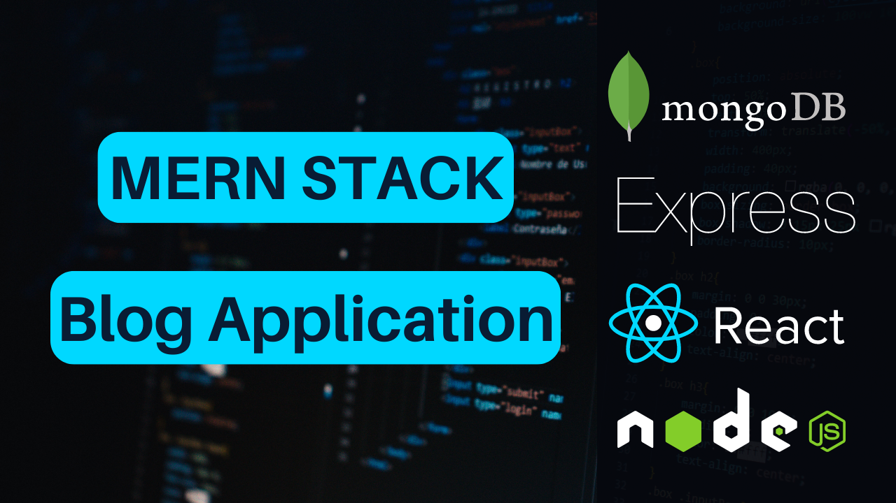

# blog-pro-MERN-stack
This repository is the client side and the server side of Blog Project built with MERN stack techs  for educational purpose 



# Usage
- Install Mongo DB on your local machine or use Mongo DB Cloud -> [Go To MongoDB Website](https://www.mongodb.com)
- Create Cloudinary account for storing the images -> [Go To Cloudinary Website](https://cloudinary.com/)
- Create `images` folder in the backend

## Environment Variables
Create `.env` file in the backend folder and add the following
```
PORT= 8000
MONGO_URI= your mongodb uri
NODE_ENV= development
JWT_SECRET= your jwt secret key
CLOUDINARY_CLOUD_NAME= your cloud name from cloudinary
CLOUDINARY_API_KEY= your api key from cloudinary
CLOUDINARY_API_SECRET= your api secret from cloudinary
APP_EMAIL_ADDRESS= your email service for sending email
APP_EMAIL_PASSWORD= your email service password
CLIENT_DOMAIN= http://localhost:3000 
```


## Install Dependencies
**backend**
```
cd backend
npm install
```
**frontend**
```
cd frontend
npm install
```


## Run
**Run the backend**
```
cd backend
npm run dev
```

**Run the frontend**
```
cd frontend
npm start
```
